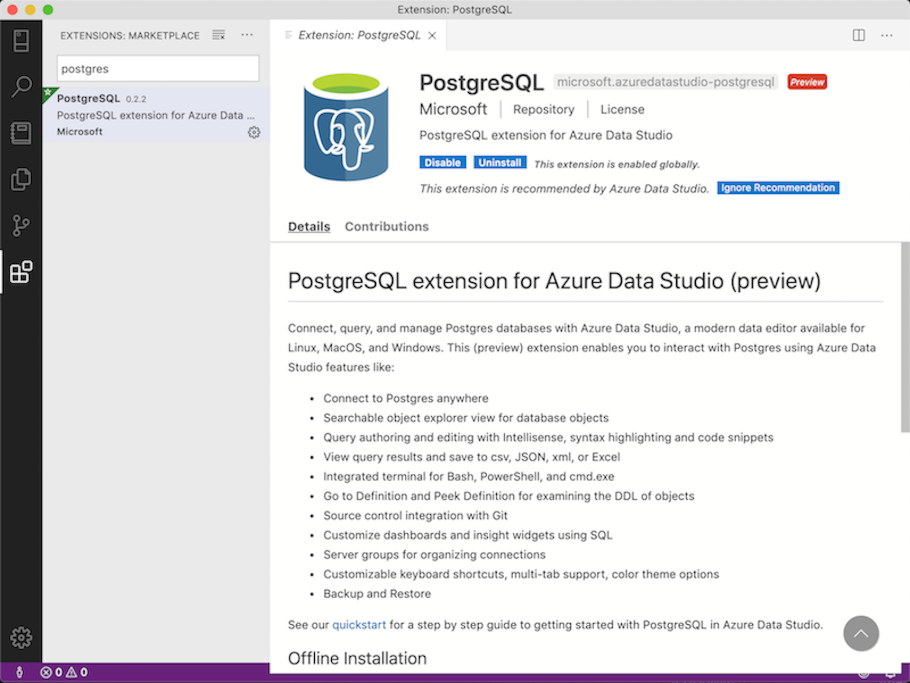
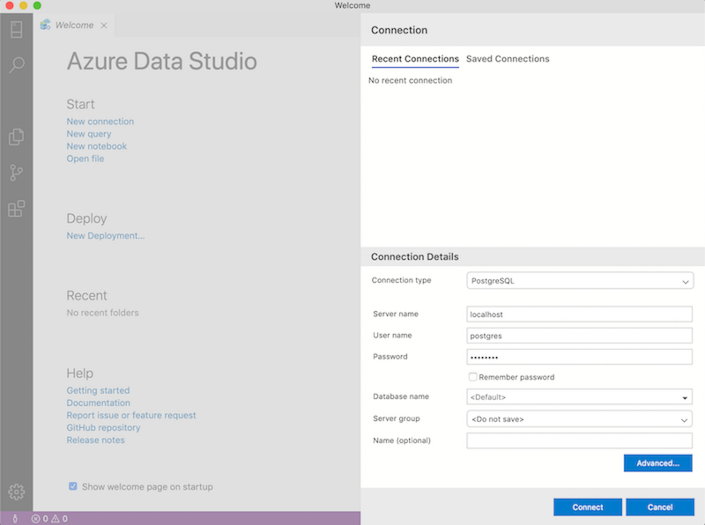
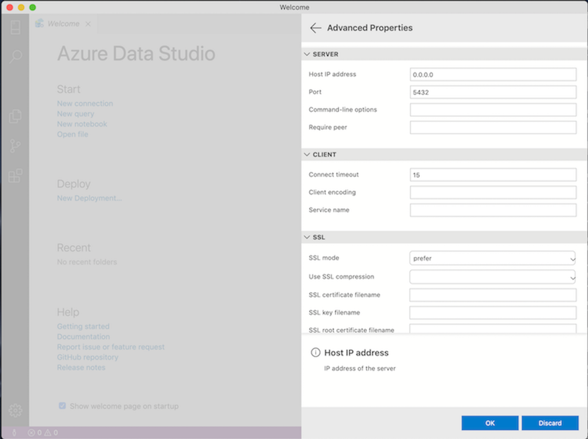
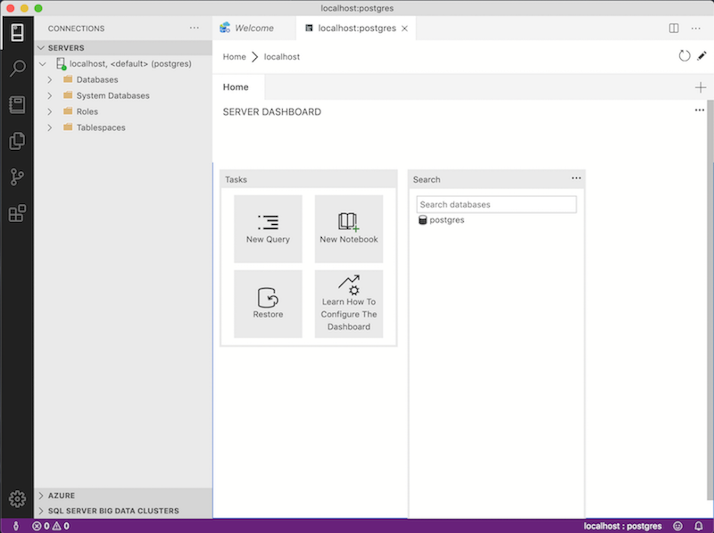

## Connect PostgreSQL in docker container with Azure Data Studio

Azure Data Studio is a cool product that can easily connect MySQL (if you already installed in your system) and show what in your database look like. What if we use PostgresSQL instead of MySQL, how should we start?

The 1st step, I decided to pull Postgres's docker image but not to install at root.

```
$ docker pull postgres
```

Second, run the container, remember to set the port for local connecting (the document didn't mention it)
```
$ docker run --name postgres-docker -e POSTGRES_PASSWROD=secret_password -p 5432:5432 -d postgres
```

then you will get container id, also can check it by `docker ps`

```
CONTAINER ID        IMAGE                 COMMAND                  CREATED             STATUS              PORTS                      NAMES
ba01d334f4db        postgres              "docker-entrypoint.s…"   37 minutes ago      Up 37 minutes       0.0.0.0:5432->5432/tcp     postgres-docker
```

---
After running the container, we could start the next step, set up the connection in Azure Data Studio.

### 1. Install PostgreSQL plug-in.
Choose the extension's icon and search Postgres then install it.

[ {:class="img-responsive"} ](../assets/img/posts/WukfL9H.png)

### 2. Click new connection, choose PostgreSQL as your database.

[ {:class="img-responsive"} ](../assets/img/posts/ACogtlC.png)

### 3. Enter the required information.

[ {:class="img-responsive"} ](../assets/img/posts/QCwXWTX.png)

### 4. Remember to set port in advanced setting.
Enter the ip and port as same as you assigned to docker container.

[ {:class="img-responsive"} ](../assets/img/posts/n6oFLe2.png)

### 5. Connect and start to work in the database.

[ {:class="img-responsive"} ](../assets/img/posts/V0rhy7k.png)

---
So far, the most important part is that remember to assign port when you run the docker container and enter the correct connection details, then it can keep your life much easier.
